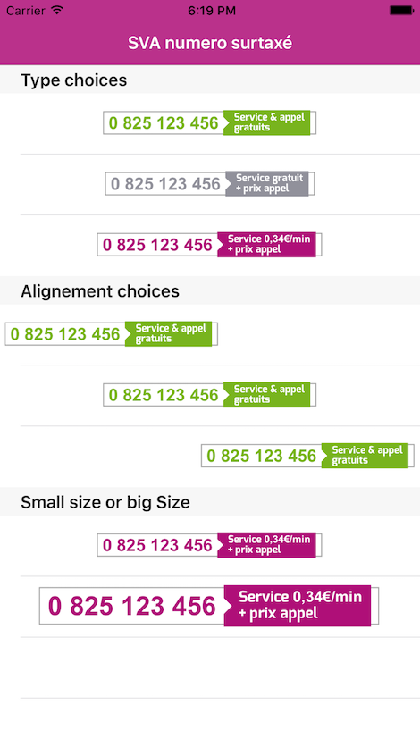
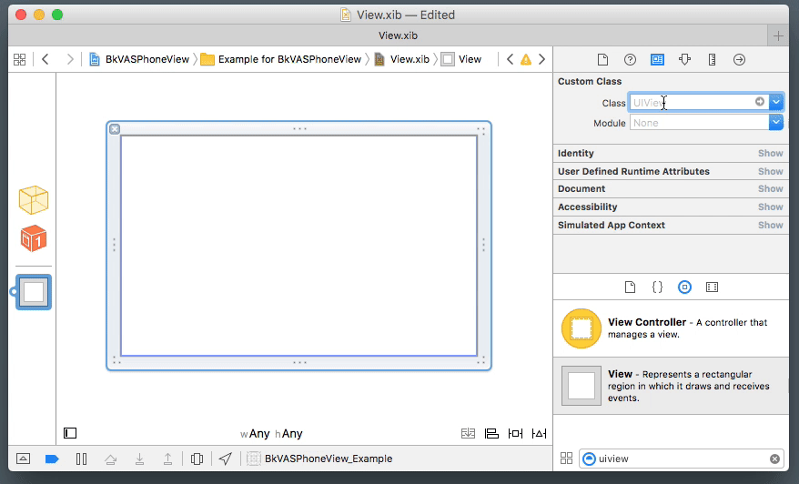

# BkVASPhoneView
=========
[](https://github.com/Backelite/MaryPopin/blob/master/LICENSE)
[](https://github.com/Backelite/BkVASPhoneView)

Custom view for phone number display, following the SVA+ requirements. Written in Objective-C.



## XIB

BkVASPhoneView is IBDesignable/IBInspectable compliant. Simply drag and drop a UIView on your storyboard/XIB, change the class to "BkVASPhoneView" and you can customize the phone number, type/color and fee display.



BkVASPhoneView works with Auto-Layout : juste like a regular UILabel, by not setting a specific width and height, its size will not exceed the size it requires.

## Programmatically

To instantiate a BkVASPhoneView :

Objective-C :
```Objective-C
BkVASPhoneView *phoneView = [[BkVASPhoneView alloc] initWithPhoneNumber:@"0 825 123 456" feeType:BkVASFeeTypePremium fee:@"0,34€/min" size:BkVASPhoneSizeSmall];
[self.view addSubview:phoneView];
```

Swift :
```Swift
let phoneView = VASPhoneView(phoneNumber: "0 802 12 12", feeType: .premium, fee: "0,34€/min", size: .small)
self.view.addSubview(phoneView)
```

To re-use an instance of BkVASPhoneView and configure it with new informations :

Objective-C :
```Objective-C
[phoneView configureWithPhoneNumber:@"0 825 123 456" feeType:BkVASFeeTypePremium fee:@"0,34€/min" size:BkVASPhoneSizeSmall];
```

Swift :
```Swift
phoneView.configure(withPhoneNumber: "0 802 12 12", feeType: .premium, fee: "0,34€/min", size: .small)
```

## Usage

To run the example project, clone the repo, and run `pod install` from the Example directory first.

## Requirements

iOS 7

## Authors

David Yang, david.yang@backelite.com

## License

BkVASPhoneView is available under the MIT license. See the LICENSE file for more info.
